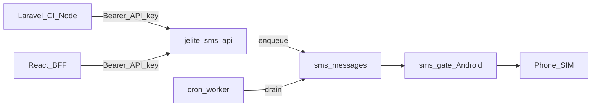
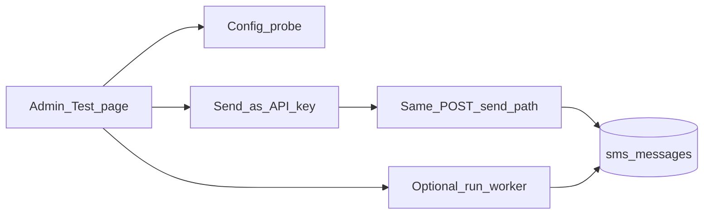
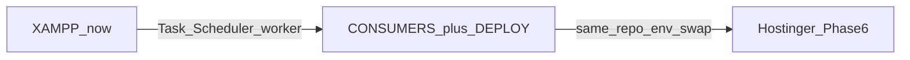

# JE Lite SMS API — Implementation Plan

**Project path:** `C:\xampp\htdocs\Projects\jelite_sms_api`  
**Purpose:** Standalone HTTP SMS API wrapping Android SMS Gateway (capcom6 / sms-gate.app) for Laravel, CodeIgniter, React backends, LOKA consumers, HRMIS, and other DICT apps.  
**Out of scope for this project:** Microsoft Entra / DICT SSO (separate plan later).

> **Status: Phase 1–5.6 COMPLETE** (API, admin, worker schedule, full consumer docs
> coverage in [`docs/CONSUMERS.md`](docs/CONSUMERS.md) + [`docs/DEPLOY.md`](docs/DEPLOY.md)).  
> **Phase 6 Hostinger deploy: SKIPPED for now** — runbook ready when you are.  
> **Remaining optional items:** delivery-state sync, `openapi.yaml`.

---

## For the next coding agent (read this first)

**Do not** implement Hostinger deploy (Phase 6 is skipped). **Do not** rebuild the API or admin UI.

**Nothing pending for coding agents** — Phase 5.6 (consumer docs coverage) is complete. Only touch this project if the user asks for the optional items (delivery-state sync, `openapi.yaml`) or un-skips Phase 6.

| Already on disk | Notes |
|-----------------|--------|
| [`docs/CONSUMERS.md`](docs/CONSUMERS.md) | **Complete**: quick start, PHP helpers, Laravel send/status/job, CodeIgniter, React Node + Laravel BFF patterns, troubleshooting |
| [`docs/DEPLOY.md`](docs/DEPLOY.md) | Keep as-is; deploy remains out of scope until user un-skips Phase 6 |
| Admin `/admin/keys`, `/admin/test`, `/admin/usage` | Referenced throughout the consumer docs |

**Out of scope this pass:** Phase 6 VPS upload, DICT SSO, LOKA migration, inbound SMS, OpenAPI (unless asked), changing runtime API behavior.

**Rules:** Never put API keys in React client env (`VITE_*` / `NEXT_PUBLIC_*`). Examples must use **local** base URL `http://localhost/projects/jelite_sms_api` with a one-line note that production URL swaps later.

---

## Locked decisions

| Decision | Choice |
|----------|--------|
| Hosting | This folder — standalone PHP + MySQL on XAMPP, **not** inside LOKA |
| Provider | [SMS Gateway for Android](https://github.com/capcom6/android-sms-gateway) / [sms-gate.app](https://sms-gate.app) |
| Consumer auth | API keys: `Authorization: Bearer <key>` |
| Frontend | React/SPA must **never** call this API with a secret; only server-side |
| Send model | Enqueue + cron/worker (soft-fail; do not block HTTP on gateway) |
| LOKA | Keeps its current direct `SmsGateway` path unless later migrated |



---

## Upstream provider (exact contract)

Mirror LOKA: `C:\xampp\htdocs\Projects\prod-loka-push\public_html\classes\SmsGateway.php`  
Ops notes: `C:\xampp\htdocs\Projects\prod-loka-push\devops\sms-gateway\README.md`  
Docs: https://docs.sms-gate.app

### Modes

| Mode | Gateway base URL | API path |
|------|------------------|----------|
| Local phone | `http://PHONE_LAN_IP:8080` | `/message` |
| Private / self-hosted | `https://sms.yourdomain.com` | `/api/3rdparty/v1/messages` |
| Public cloud | `https://api.sms-gate.app` | `/3rdparty/v1/messages` |

- Cloud: **HTTPS only** (HTTP can 308 and break POST).
- Auth to gateway: **HTTP Basic** (username/password from Android app).
- Never expose gateway password to API consumers.

### Upstream POST body

```json
{
  "textMessage": { "text": "Your message" },
  "phoneNumbers": ["+639171234567"]
}
```

---

## Public API (v1) — ✅ all live and smoke-tested

| Method | Path | Auth | Purpose | Status |
|--------|------|------|---------|--------|
| `POST` | `/api/v1/sms/send` | Bearer | Enqueue SMS | ✅ |
| `GET` | `/api/v1/sms/{id}` | Bearer | Queue/delivery status (key-isolated) | ✅ |
| `GET` | `/api/v1/health` | none | Liveness + gateway reachability (no secrets) | ✅ |

Extras shipped beyond the original spec: idempotent `client_ref` replay (`200` + same id),
per-key rate limiting (`429`), key isolation on status reads, `400 invalid_json` / `422 validation_failed`
JSON errors.

### POST `/api/v1/sms/send`

```json
{
  "to": "+639171234567",
  "message": "Your text",
  "client_ref": "optional-idempotency-or-app-ref"
}
```

**Response `202`:**

```json
{ "id": "...", "status": "queued" }
```

---

## Build phases

### Phase 1 — Scaffold — ✅ DONE

1. ✅ PHP router / front controller (`index.php` + `.htaccess`, XAMPP-friendly URL; base path derived from filesystem, `Authorization` header preserved through mod_rewrite).
2. ✅ `.env` + `.env.example` (real secrets gitignored).
3. ✅ Separate MySQL databases for **dev / test / prod** via `APP_ENV` (`jelite_sms_api_dev/_test/_prod`); dev + test created.
4. ✅ Config: `APP_URL`, DB creds, gateway URL/user/pass/path, timeouts, default country `63`, max message length `320` (+ `SMS_MAX_ATTEMPTS`, `WORKER_BATCH_SIZE`).

### Phase 2 — Data model — ✅ DONE

Tables (in `database/schema.sql`, applied by `bin/setup.php`):

- ✅ `api_keys` — name, SHA-256 key hash, prefix for display, active, rate limits, created/revoked
- ✅ `sms_messages` — id, api_key_id, to_e164, body, client_ref (unique per key → idempotency), status (`queued` / `sending` / `sent` / `failed`), gateway_message_id, error, attempts, timestamps

### Phase 3 — Core services — ✅ DONE

1. ✅ Phone normalize to E.164 (default country `63`) — `src/Phone.php`
2. ✅ `SmsGateway` client ported from LOKA (`src/SmsGateway.php`: Basic auth, JSON payload, short timeouts, no follow redirects, cloud-path forcing, URL normalization; injectable transport for tests)
3. ✅ Queue enqueue on `POST /send`; worker drains queue (`bin/worker.php`, soft-fail with retry until `SMS_MAX_ATTEMPTS`)
4. ✅ API key create/revoke/list CLI (`bin/manage-keys.php`); **hashed** keys only
5. ✅ Rate limiting per key; validation errors as clear JSON

### Phase 4 — Docs and tests — mostly done

1. ✅ `README.md` — setup, env, curl, Laravel HTTP client, CodeIgniter/PHP example, React-via-backend note
2. ⬜ Optional `openapi.yaml`
3. ✅ Tests (`tests/run.php`, dependency-free runner): auth, validation, enqueue/status/idempotency/rate-limit, gateway contract, worker drain — **63/63 passing**; gateway mocked only in tests

### Phase 5 — Admin UI (config + keys) — ✅ DONE (incl. Test/Playground page)

Browser interface so operators can change gateway/SMS settings and manage API keys without hand-editing `.env` for every tweak. Same PHP project + HTML/CSS/JS (no separate React admin SPA).

#### Locked design choices

| Choice | Decision |
|--------|----------|
| URLs | `/admin` (login), `/admin/settings`, `/admin/keys`, `/admin/messages`, `/admin/usage`, `/admin/test` |
| Auth | Session cookie; bootstrap only in `.env`: `ADMIN_USER`, `ADMIN_PASSWORD` |
| Storage | MySQL `app_settings` (not JSON files) |
| UI can change | Gateway + SMS tunables + API keys |
| Stays in `.env` only | `APP_ENV`, `DB_*`, `ADMIN_*` (not editable in UI) |

#### Local URL

`http://localhost/projects/jelite_sms_api/admin`

#### Settings page (editable) — ✅

- `SMS_GATEWAY_URL`, `SMS_GATEWAY_USERNAME`, `SMS_GATEWAY_PASSWORD` (masked), `SMS_API_PATH`
- `SMS_TIMEOUT_SECONDS`, `SMS_DEFAULT_COUNTRY_CODE`, `SMS_MAX_MESSAGE_LENGTH`
- `SMS_MAX_ATTEMPTS`, `WORKER_BATCH_SIZE`, `APP_URL`

#### API Keys page — ✅

- Create / list / revoke; plaintext key shown **once** on create

#### Messages page (read-only) — ✅

- Recent queue rows: id, to, status, attempts, error, timestamps

#### Usage page — ✅ DONE (`/admin/usage`)

Monitor **which consumer apps** use the API (each named API key = one app).

- Date filter (`from` / `to`, default last 7 days, max 366-day window)
- Per-key table: name, prefix, active/revoked, **total / sent / failed / queued / sending**, **last used**
- Summary totals for the selected range
- Data from `sms_messages` joined to `api_keys` (no extra logging table)

#### Test / Playground page — ✅ DONE (`/admin/test`)

Operator page to **verify config** and **send a test SMS the same way consumer apps do** (Laravel, CI, React backends, other PHP), without leaving the admin UI or using curl.



**A. Test config (no real SMS)**

- Button: **Check configuration**
- Runs the same checks as `GET /api/v1/health` (and related gateway probe): database up/down, gateway configured yes/no, gateway reachable/unreachable
- Shows clear pass/fail in the UI (no secrets displayed)
- Optional: show effective (resolved) non-secret settings: gateway URL, API path, country code, max length, timeouts — so you can confirm DB overrides vs `.env`

**B. Send test SMS (as a consumer app)**

- Purpose: simulate what happens when another app calls `POST /api/v1/sms/send` with a Bearer key
- Form fields:
  - **API key** — dropdown of active keys (by name / id / prefix); send is attributed to that consumer key (rate limit + ownership match production)
  - **to** — phone (E.164 or local)
  - **message** — text
  - **client_ref** — optional idempotency ref
  - **Run worker once after enqueue** — checkbox (local/Hostinger debugging so status can move past `queued` without waiting for cron)
- Server uses the **same validation + enqueue path** as the public API (`App` send handler): same `202`/`200`/`422`/`429` JSON shape consumers get
- After submit: show HTTP-style status + JSON body (`id`, `status`), link to **Messages**, and optional status refresh for that id
- Does **not** require pasting the plaintext Bearer key (admin selects key by id; plaintext remains unrecoverable from DB)

**C. Security / rules for Test page**

- Still requires admin login + CSRF
- Consumer Bearer keys cannot open `/admin/test`
- Test sends count against the selected key’s rate limit (realistic)
- Warn in UI: this can send a **real SMS** if gateway + worker are configured
- React/SPA still never calls this page

#### Config resolution order — ✅

1. Row in `app_settings` (if present and non-empty)  
2. Else `.env` / process env  
3. Else code default  

#### Schema — ✅ `app_settings` in `database/schema.sql`

#### Security rules — ✅ for existing pages; apply to Test page too

- Admin routes require login; consumer Bearer keys do **not** grant admin
- Never show full gateway password after save
- CSRF on admin POSTs
- React/SPA must never call `/admin` or hold SMS API / gateway secrets

#### Implementation touch list for Test page — ✅ all done

- ✅ `AdminApp.php` / `AdminViews.php`: routes `GET|POST /admin/test` (+ `/admin/test/probe`, `/admin/test/send`), nav link **Test**
- ✅ Reuse `App` health + send logic (`App::probe()`, `App::sendRaw()` — no duplicated validation)
- ✅ One-shot worker drain from admin (shared `Worker::drain()` with `bin/worker.php`)
- ✅ Tests in `tests/AdminTest.php`: config probe, send-as-key enqueue, auth gate, CSRF, rate-limit attribution
- ✅ `README.md` — documents `/admin/test`

#### Build order (remaining) — ✅ complete

---

### Phase 5.5 — Local-first ops + docs (Hostinger-ready later) — ✅ DONE

Still testing on **XAMPP localhost**. Do **not** upload to Hostinger in this phase. Keep one codebase portable: local today → env + cron swap on VPS later.



#### Locked scope

| Do now (Phase 5.5) | Defer |
|--------------------|--------|
| Automate worker on **XAMPP** (Task Scheduler) | Live Hostinger upload/deploy (Phase 6) |
| Portable schedule docs + Hostinger cron **snippet** for later | Delivery-state sync, OpenAPI, alerts |
| Document API usage for fresh **PHP**, **Laravel**, **React** projects | Wiring real Hostinger apps in their repos |

#### 1. Worker automation (local, portable) — ✅ DONE

Verified live: task "JE Lite SMS Worker" registered (result 0), enqueued message auto-sent by the schedule within one minute, no manual step.

Without a schedule, messages stay `queued` unless Admin → Test “run worker” or CLI is used.

- Document Windows Task Scheduler every minute, e.g.:

```
C:\xampp\php\php.exe C:\xampp\htdocs\Projects\jelite_sms_api\bin\worker.php
```

- Add `bin/register-worker-task.ps1` — registers the task using paths derived from the project folder (re-run after moving the folder).
- Same docs section includes **Hostinger cron** one-liner for Phase 6 (copy-paste later):

```
* * * * * php /path/to/jelite_sms_api/bin/worker.php >> /path/to/jelite_sms_api/worker.log 2>&1
```

#### 2. Deploy portability runbook — ✅ DONE (`docs/DEPLOY.md`)

One codebase; only env/hosting differs. Document what to change when uploading later (no live deploy yet):

| Setting | Local XAMPP | Hostinger later |
|---------|-------------|-----------------|
| `APP_URL` | `http://localhost/projects/jelite_sms_api` | `https://sms-api.yourdomain.com` |
| `APP_ENV` | `dev` | `prod` → DB `jelite_sms_api_prod` |
| `DB_*` | local MySQL | Hostinger MySQL |
| Gateway | cloud or LAN phone | **cloud only** (`api.sms-gate.app`) |
| Worker | Task Scheduler | cron |
| Admin | `/admin` | same paths under new base URL |

Also: never commit `.env`; upload code + `.env.example`; run `bin/setup.php` on server; create new prod API keys (or migrate carefully).

#### 3. Consumer documentation — ✅ DONE (`docs/CONSUMERS.md`)

Full usage guides for fresh projects; link from `README.md`. Shared contract:

- Base URL (local now; VPS URL later)
- `Authorization: Bearer <key>` — **one named key per app** (Admin → API Keys)
- `POST /api/v1/sms/send` → `{ to, message, client_ref? }` → `202` + `{ id, status }`
- `GET /api/v1/sms/{id}` for status
- Never put the key in browser / `NEXT_PUBLIC_*` / Vite client env

**Plain PHP:** config `SMS_API_URL` + `SMS_API_KEY`; curl send + status + `401`/`422`/`429` handling.

**Laravel:** `.env` + optional `config/services.php`; `Http::withToken(...)->post(...)`; call from controller/job/service only.

**React:** browser never calls this API. Pattern: React UI → your Laravel/Node/PHP backend → jelite_sms_api with server-side key. Document anti-pattern of SPA `fetch` with Bearer.

Local examples use: `http://localhost/projects/jelite_sms_api`  
Note in each section: swap base URL when Phase 6 goes live.

#### Phase 5.5 done when — ✅ all met

1. ✅ Worker runs every minute on XAMPP via Task Scheduler (script + docs) — verified live end-to-end.
2. ✅ `docs/CONSUMERS.md` covers PHP, Laravel, React.
3. ✅ `docs/DEPLOY.md` lists exactly what to change on upload.
4. ✅ `README.md` / this plan point to those docs.

---

### Phase 5.6 — Consumer docs coverage — ✅ DONE

**Goal:** Make [`docs/CONSUMERS.md`](docs/CONSUMERS.md) the complete integration guide for fresh projects. Baseline file already exists — **expand and restructure**; do not throw it away. Phase 6 deploy remains skipped.

#### Current coverage (baseline — keep and improve)

| Stack | Already in CONSUMERS.md | Gaps to fill |
|-------|-------------------------|--------------|
| Shared contract | Auth, send/status codes, phone formats, no-browser-keys | Quick-start checklist (create key → `.env` → first send → Usage) |
| Plain PHP | `.env`, `smsSend` curl helper, short status curl | Full `smsStatus()` helper; curl one-liners; health check |
| Laravel | `config/services.php`, `SmsService::send`, controller snippet | `status($id)` method; queued Job example; exception mapping for 401/422/429 |
| React | SPA→backend→SMS API; Node/Express sample; anti-pattern | **Laravel BFF** example (common for DICT apps); what the React UI may safely show |
| Extra | Testing via Admin → Test | Troubleshooting table; CodeIgniter short section (project purpose lists CI) |

#### Agent implementation checklist (Phase 5.6)

1. **Quick start (top of CONSUMERS.md)** — numbered steps:
   1. Open Admin → API Keys → create named key (e.g. `MyLaravelApp`)
   2. Copy plaintext key once into the consumer app `.env`
   3. Set `SMS_API_URL=http://localhost/projects/jelite_sms_api`
   4. Send first SMS (link to stack section)
   5. Confirm in Admin → Messages / Usage; optional Admin → Test
2. **Expand Plain PHP** — complete status helper + copy-paste `curl.exe` send/status/health examples for Windows.
3. **Expand Laravel** — `SmsService` with `send` + `status`; map HTTP codes; example Job; remind not to call from Blade with embedded secrets.
4. **Expand React** — keep Node sample; **add Laravel-as-BFF** route example the React app calls; clarify UI only sees `{ ok: true }` / business errors, never the gateway password or SMS API key.
5. **Add CodeIgniter (short)** — `.env` + simple curl/`CURLRequest` send snippet (aligned with project purpose).
6. **Add Troubleshooting** — table for 401 / 422 / 429 / stuck `queued` (worker not running → point to `bin/register-worker-task.ps1`) / wrong phone format.
7. **README** — keep prominent link to `docs/CONSUMERS.md`; ensure Layout table lists it.
8. **Mark Phase 5.6 done** in this `PLAN.md` when the checklist above is met.

#### Phase 5.6 done when

- [x] Quick-start checklist present
- [x] PHP / Laravel / React sections are copy-paste complete for a fresh project (incl. status where relevant)
- [x] React includes a Laravel BFF path (not only Node)
- [x] Short CodeIgniter section present
- [x] Troubleshooting section present
- [x] README still points at `docs/CONSUMERS.md`
- [x] This plan's Phase 5.6 status flipped to DONE

---

### Phase 6 — Hostinger deploy — SKIPPED (for now)

Do **not** implement until the user explicitly asks. Runbook remains in [`docs/DEPLOY.md`](docs/DEPLOY.md) for later.

When un-skipped: same VPS as consumer apps, cloud gateway only, cron for `bin/worker.php`, one key per app — follow `docs/DEPLOY.md`.

---

### Remaining (priority order)

**Phase 5.5 — COMPLETE** (baseline docs + local worker schedule).

**Phase 5.6 — COMPLETE** (`docs/CONSUMERS.md` expanded: quick start, full PHP helpers,
Laravel send/status/job, CodeIgniter, React Node + Laravel BFF patterns, troubleshooting table).

**Phase 6 — SKIPPED:**

- Live Hostinger deploy (user deferred)

**Later / optional (only if user asks):**

- Delivery-state sync
- `openapi.yaml`

Diagnostics helpers: `bin/check-queue.php`, `bin/check-message.php <gateway_message_id>`.

---

## Suggested env vars — core + ADMIN_* supported

```
APP_URL=http://localhost/projects/jelite_sms_api
APP_ENV=dev

DB_HOST=127.0.0.1
DB_USER=root
DB_PASS=

SMS_GATEWAY_URL=https://api.sms-gate.app
SMS_GATEWAY_USERNAME=
SMS_GATEWAY_PASSWORD=
SMS_API_PATH=/3rdparty/v1/messages
SMS_TIMEOUT_SECONDS=15
SMS_DEFAULT_COUNTRY_CODE=63
SMS_MAX_MESSAGE_LENGTH=320
SMS_MAX_ATTEMPTS=3
WORKER_BATCH_SIZE=20

# Phase 5 — admin bootstrap (not editable in UI)
ADMIN_USER=admin
ADMIN_PASSWORD=
```

DB name is derived as `jelite_sms_api_{APP_ENV}` (no `DB_NAME` required).  
Local phone test: `SMS_GATEWAY_URL=http://PHONE_IP:8080` and `SMS_API_PATH=/message`.

---

## Consumer examples

Short examples in `README.md`. **Full fresh-project guides:** [`docs/CONSUMERS.md`](docs/CONSUMERS.md).

```bash
curl -X POST "http://localhost/projects/jelite_sms_api/api/v1/sms/send" \
  -H "Authorization: Bearer YOUR_API_KEY" \
  -H "Content-Type: application/json" \
  -d "{\"to\":\"+639171234567\",\"message\":\"Hello from JE Lite SMS API\"}"
```

Laravel: `Http::withToken($key)->post($base.'/api/v1/sms/send', [...])`  
React: call your Laravel/CI/Node backend only — never embed the Bearer key in the browser.

---

## After Phase 1 ships

- Prod API keys per consumer when Phase 6 is un-skipped; local keys anytime via Admin → API Keys.
- Keep LOKA on its existing gateway until you choose to migrate (untouched).
- SSO / Sign in with DICT stays on the parked plan outside this folder.

---

## How to start in Cursor (next agent)

1. **File → Open Folder** → `C:\xampp\htdocs\Projects\jelite_sms_api`
2. Read **"For the next coding agent"** in this file — all planned phases are complete
3. Only act if the user asks for optional items (delivery-state sync, `openapi.yaml`) or un-skips **Phase 6** (Hostinger deploy — follow `docs/DEPLOY.md`)
4. Only create a git commit if the user explicitly asks
