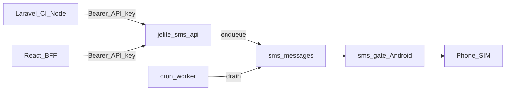
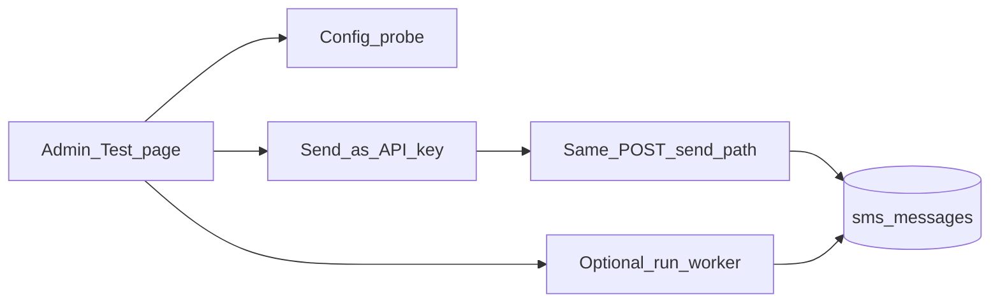
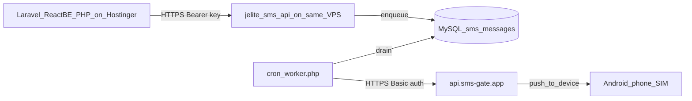

# JE Lite SMS API — Implementation Plan

**Project path:** `C:\xampp\htdocs\Projects\jelite_sms_api`  
**Purpose:** Standalone HTTP SMS API wrapping Android SMS Gateway (capcom6 / sms-gate.app) for Laravel, CodeIgniter, React backends, LOKA consumers, HRMIS, and other DICT apps.  
**Out of scope for this project:** Microsoft Entra / DICT SSO (separate plan later).

> **Status: Phase 1–5 core COMPLETE; Test/Playground page still planned.** Items marked ✅ are
> implemented. Remaining: **Phase 5 Test page** (config probe + send-as-consumer), live gateway
> verification, Hostinger deploy (Phase 6), optional `openapi.yaml`.

---

## Locked decisions

| Decision | Choice |
|----------|--------|
| Hosting | This folder — standalone PHP + MySQL on XAMPP, **not** inside LOKA |
| Provider | [SMS Gateway for Android](https://github.com/capcom6/android-sms-gateway) / [sms-gate.app](https://sms-gate.app) |
| Consumer auth | API keys: `Authorization: Bearer <key>` |
| Frontend | React/SPA must **never** call this API with a secret; only server-side |
| Send model | Enqueue + cron/worker (soft-fail; do not block HTTP on gateway) |
| LOKA | Keeps its current direct `SmsGateway` path unless later migrated |



---

## Upstream provider (exact contract)

Mirror LOKA: `C:\xampp\htdocs\Projects\prod-loka-push\public_html\classes\SmsGateway.php`  
Ops notes: `C:\xampp\htdocs\Projects\prod-loka-push\devops\sms-gateway\README.md`  
Docs: https://docs.sms-gate.app

### Modes

| Mode | Gateway base URL | API path |
|------|------------------|----------|
| Local phone | `http://PHONE_LAN_IP:8080` | `/message` |
| Private / self-hosted | `https://sms.yourdomain.com` | `/api/3rdparty/v1/messages` |
| Public cloud | `https://api.sms-gate.app` | `/3rdparty/v1/messages` |

- Cloud: **HTTPS only** (HTTP can 308 and break POST).
- Auth to gateway: **HTTP Basic** (username/password from Android app).
- Never expose gateway password to API consumers.

### Upstream POST body

```json
{
  "textMessage": { "text": "Your message" },
  "phoneNumbers": ["+639171234567"]
}
```

---

## Public API (v1) — ✅ all live and smoke-tested

| Method | Path | Auth | Purpose | Status |
|--------|------|------|---------|--------|
| `POST` | `/api/v1/sms/send` | Bearer | Enqueue SMS | ✅ |
| `GET` | `/api/v1/sms/{id}` | Bearer | Queue/delivery status (key-isolated) | ✅ |
| `GET` | `/api/v1/health` | none | Liveness + gateway reachability (no secrets) | ✅ |

Extras shipped beyond the original spec: idempotent `client_ref` replay (`200` + same id),
per-key rate limiting (`429`), key isolation on status reads, `400 invalid_json` / `422 validation_failed`
JSON errors.

### POST `/api/v1/sms/send`

```json
{
  "to": "+639171234567",
  "message": "Your text",
  "client_ref": "optional-idempotency-or-app-ref"
}
```

**Response `202`:**

```json
{ "id": "...", "status": "queued" }
```

---

## Build phases

### Phase 1 — Scaffold — ✅ DONE

1. ✅ PHP router / front controller (`index.php` + `.htaccess`, XAMPP-friendly URL; base path derived from filesystem, `Authorization` header preserved through mod_rewrite).
2. ✅ `.env` + `.env.example` (real secrets gitignored).
3. ✅ Separate MySQL databases for **dev / test / prod** via `APP_ENV` (`jelite_sms_api_dev/_test/_prod`); dev + test created.
4. ✅ Config: `APP_URL`, DB creds, gateway URL/user/pass/path, timeouts, default country `63`, max message length `320` (+ `SMS_MAX_ATTEMPTS`, `WORKER_BATCH_SIZE`).

### Phase 2 — Data model — ✅ DONE

Tables (in `database/schema.sql`, applied by `bin/setup.php`):

- ✅ `api_keys` — name, SHA-256 key hash, prefix for display, active, rate limits, created/revoked
- ✅ `sms_messages` — id, api_key_id, to_e164, body, client_ref (unique per key → idempotency), status (`queued` / `sending` / `sent` / `failed`), gateway_message_id, error, attempts, timestamps

### Phase 3 — Core services — ✅ DONE

1. ✅ Phone normalize to E.164 (default country `63`) — `src/Phone.php`
2. ✅ `SmsGateway` client ported from LOKA (`src/SmsGateway.php`: Basic auth, JSON payload, short timeouts, no follow redirects, cloud-path forcing, URL normalization; injectable transport for tests)
3. ✅ Queue enqueue on `POST /send`; worker drains queue (`bin/worker.php`, soft-fail with retry until `SMS_MAX_ATTEMPTS`)
4. ✅ API key create/revoke/list CLI (`bin/manage-keys.php`); **hashed** keys only
5. ✅ Rate limiting per key; validation errors as clear JSON

### Phase 4 — Docs and tests — mostly done

1. ✅ `README.md` — setup, env, curl, Laravel HTTP client, CodeIgniter/PHP example, React-via-backend note
2. ⬜ Optional `openapi.yaml`
3. ✅ Tests (`tests/run.php`, dependency-free runner): auth, validation, enqueue/status/idempotency/rate-limit, gateway contract, worker drain — **63/63 passing**; gateway mocked only in tests

### Phase 5 — Admin UI (config + keys) — ✅ DONE (incl. Test/Playground page)

Browser interface so operators can change gateway/SMS settings and manage API keys without hand-editing `.env` for every tweak. Same PHP project + HTML/CSS/JS (no separate React admin SPA).

#### Locked design choices

| Choice | Decision |
|--------|----------|
| URLs | `/admin` (login), `/admin/settings`, `/admin/keys`, `/admin/messages`, **`/admin/test`** (planned) |
| Auth | Session cookie; bootstrap only in `.env`: `ADMIN_USER`, `ADMIN_PASSWORD` |
| Storage | MySQL `app_settings` (not JSON files) |
| UI can change | Gateway + SMS tunables + API keys |
| Stays in `.env` only | `APP_ENV`, `DB_*`, `ADMIN_*` (not editable in UI) |

#### Local URL

`http://localhost/projects/jelite_sms_api/admin`

#### Settings page (editable) — ✅

- `SMS_GATEWAY_URL`, `SMS_GATEWAY_USERNAME`, `SMS_GATEWAY_PASSWORD` (masked), `SMS_API_PATH`
- `SMS_TIMEOUT_SECONDS`, `SMS_DEFAULT_COUNTRY_CODE`, `SMS_MAX_MESSAGE_LENGTH`
- `SMS_MAX_ATTEMPTS`, `WORKER_BATCH_SIZE`, `APP_URL`

#### API Keys page — ✅

- Create / list / revoke; plaintext key shown **once** on create

#### Messages page (read-only) — ✅

- Recent queue rows: id, to, status, attempts, error, timestamps

#### Test / Playground page — ✅ DONE (`/admin/test`)

Operator page to **verify config** and **send a test SMS the same way consumer apps do** (Laravel, CI, React backends, other PHP), without leaving the admin UI or using curl.



**A. Test config (no real SMS)**

- Button: **Check configuration**
- Runs the same checks as `GET /api/v1/health` (and related gateway probe): database up/down, gateway configured yes/no, gateway reachable/unreachable
- Shows clear pass/fail in the UI (no secrets displayed)
- Optional: show effective (resolved) non-secret settings: gateway URL, API path, country code, max length, timeouts — so you can confirm DB overrides vs `.env`

**B. Send test SMS (as a consumer app)**

- Purpose: simulate what happens when another app calls `POST /api/v1/sms/send` with a Bearer key
- Form fields:
  - **API key** — dropdown of active keys (by name / id / prefix); send is attributed to that consumer key (rate limit + ownership match production)
  - **to** — phone (E.164 or local)
  - **message** — text
  - **client_ref** — optional idempotency ref
  - **Run worker once after enqueue** — checkbox (local/Hostinger debugging so status can move past `queued` without waiting for cron)
- Server uses the **same validation + enqueue path** as the public API (`App` send handler): same `202`/`200`/`422`/`429` JSON shape consumers get
- After submit: show HTTP-style status + JSON body (`id`, `status`), link to **Messages**, and optional status refresh for that id
- Does **not** require pasting the plaintext Bearer key (admin selects key by id; plaintext remains unrecoverable from DB)

**C. Security / rules for Test page**

- Still requires admin login + CSRF
- Consumer Bearer keys cannot open `/admin/test`
- Test sends count against the selected key’s rate limit (realistic)
- Warn in UI: this can send a **real SMS** if gateway + worker are configured
- React/SPA still never calls this page

#### Config resolution order — ✅

1. Row in `app_settings` (if present and non-empty)  
2. Else `.env` / process env  
3. Else code default  

#### Schema — ✅ `app_settings` in `database/schema.sql`

#### Security rules — ✅ for existing pages; apply to Test page too

- Admin routes require login; consumer Bearer keys do **not** grant admin
- Never show full gateway password after save
- CSRF on admin POSTs
- React/SPA must never call `/admin` or hold SMS API / gateway secrets

#### Implementation touch list for Test page — ✅ all done

- ✅ `AdminApp.php` / `AdminViews.php`: routes `GET|POST /admin/test` (+ `/admin/test/probe`, `/admin/test/send`), nav link **Test**
- ✅ Reuse `App` health + send logic (`App::probe()`, `App::sendRaw()` — no duplicated validation)
- ✅ One-shot worker drain from admin (shared `Worker::drain()` with `bin/worker.php`)
- ✅ Tests in `tests/AdminTest.php`: config probe, send-as-key enqueue, auth gate, CSRF, rate-limit attribution
- ✅ `README.md` — documents `/admin/test`

#### Build order (remaining) — ✅ complete

---

### Phase 6 — Hostinger deploy (consumer apps already on VPS) — ⬜ PLANNED

Consumer apps already live on **Hostinger VPS KVM 2**. Deploy this API on the **same VPS**. The physical phone uses **sms-gate.app public cloud** (Hostinger cannot reach a phone LAN IP).



1. Phone: Android SMS Gateway in **cloud** mode; credentials via Admin → Settings (or `.env`).
2. Upload project to Hostinger (subdomain preferred, e.g. `https://sms-api.yourdomain.com`).
3. `APP_ENV=prod`, MySQL, `bin/setup.php`, cron every minute for `bin/worker.php`.
4. One API key per consumer app; each app’s **server** `.env` gets `SMS_API_URL` + `SMS_API_KEY`.
5. React browser never holds the key — only backends call this API.

Do **not** set `SMS_GATEWAY_URL` to `http://192.168.x.x:8080` on Hostinger.

---

### Remaining (not yet built)

- ✅ Gateway credentials configured (via Admin Settings) and **live SMS verified end-to-end** (202 queued → worker → cloud `Pending` → device `Delivered` on real phone)
- ⬜ Optional: delivery-state sync — poll gateway for `Sent`/`Delivered` states and update `sms_messages.status`
- ⬜ Schedule `bin/worker.php` via cron / Windows Task Scheduler (local) and Hostinger cron (prod)
- ⬜ **Phase 6 — Hostinger deploy** + `_prod` database
- ⬜ Issue dedicated API keys per consumer (HRMIS, Laravel app, etc.)
- ⬜ Optional: `openapi.yaml`

Diagnostics helpers: `bin/check-queue.php` (recent queue rows), `bin/check-message.php <gateway_message_id>` (live gateway state).

---

## Suggested env vars — ✅ core + ADMIN_* supported

```
APP_URL=http://localhost/projects/jelite_sms_api
APP_ENV=dev

DB_HOST=127.0.0.1
DB_USER=root
DB_PASS=

SMS_GATEWAY_URL=https://api.sms-gate.app
SMS_GATEWAY_USERNAME=
SMS_GATEWAY_PASSWORD=
SMS_API_PATH=/3rdparty/v1/messages
SMS_TIMEOUT_SECONDS=15
SMS_DEFAULT_COUNTRY_CODE=63
SMS_MAX_MESSAGE_LENGTH=320
SMS_MAX_ATTEMPTS=3
WORKER_BATCH_SIZE=20

# Phase 5 — admin bootstrap (not editable in UI)
ADMIN_USER=admin
ADMIN_PASSWORD=
```

DB name is derived as `jelite_sms_api_{APP_ENV}` (no `DB_NAME` required).  
Local phone test: `SMS_GATEWAY_URL=http://PHONE_IP:8080` and `SMS_API_PATH=/message`.

---

## Consumer examples (target README) — ✅ shipped in README.md

```bash
curl -X POST "http://localhost/projects/jelite_sms_api/api/v1/sms/send" \
  -H "Authorization: Bearer YOUR_API_KEY" \
  -H "Content-Type: application/json" \
  -d "{\"to\":\"+639171234567\",\"message\":\"Hello from JE Lite SMS API\"}"
```

Laravel: `Http::withToken($key)->post($base.'/api/v1/sms/send', [...])`  
React: call your Laravel/CI/Node backend only — never embed the Bearer key in the browser.

---

## After Phase 1 ships

- ⬜ Issue separate API keys per consumer (HRMIS, Laravel app, etc.).
- ✅ Keep LOKA on its existing gateway until you choose to migrate (untouched).
- ✅ SSO / Sign in with DICT stays on the parked plan outside this folder.

---

## How to start in Cursor

1. **File → Open Folder** → `C:\xampp\htdocs\Projects\jelite_sms_api`
2. New **Agent** chat
3. Paste the contents of [`NEW_CHAT_PROMPT.md`](NEW_CHAT_PROMPT.md)
4. Say: implement **Phase 5 `/admin/test` (config probe + send-as-consumer)** per `PLAN.md`, or continue Hostinger Phase 6 when ready
