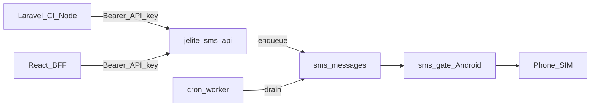

# JE Lite SMS API — Implementation Plan

**Project path:** `C:\xampp\htdocs\Projects\jelite_sms_api`  
**Purpose:** Standalone HTTP SMS API wrapping Android SMS Gateway (capcom6 / sms-gate.app) for Laravel, CodeIgniter, React backends, LOKA consumers, HRMIS, and other DICT apps.  
**Out of scope for this project:** Microsoft Entra / DICT SSO (separate plan later).

---

## Locked decisions

| Decision | Choice |
|----------|--------|
| Hosting | This folder — standalone PHP + MySQL on XAMPP, **not** inside LOKA |
| Provider | [SMS Gateway for Android](https://github.com/capcom6/android-sms-gateway) / [sms-gate.app](https://sms-gate.app) |
| Consumer auth | API keys: `Authorization: Bearer <key>` |
| Frontend | React/SPA must **never** call this API with a secret; only server-side |
| Send model | Enqueue + cron/worker (soft-fail; do not block HTTP on gateway) |
| LOKA | Keeps its current direct `SmsGateway` path unless later migrated |



---

## Upstream provider (exact contract)

Mirror LOKA: `C:\xampp\htdocs\Projects\prod-loka-push\public_html\classes\SmsGateway.php`  
Ops notes: `C:\xampp\htdocs\Projects\prod-loka-push\devops\sms-gateway\README.md`  
Docs: https://docs.sms-gate.app

### Modes

| Mode | Gateway base URL | API path |
|------|------------------|----------|
| Local phone | `http://PHONE_LAN_IP:8080` | `/message` |
| Private / self-hosted | `https://sms.yourdomain.com` | `/api/3rdparty/v1/messages` |
| Public cloud | `https://api.sms-gate.app` | `/3rdparty/v1/messages` |

- Cloud: **HTTPS only** (HTTP can 308 and break POST).
- Auth to gateway: **HTTP Basic** (username/password from Android app).
- Never expose gateway password to API consumers.

### Upstream POST body

```json
{
  "textMessage": { "text": "Your message" },
  "phoneNumbers": ["+639171234567"]
}
```

---

## Public API (v1)

| Method | Path | Auth | Purpose |
|--------|------|------|---------|
| `POST` | `/api/v1/sms/send` | Bearer | Enqueue SMS |
| `GET` | `/api/v1/sms/{id}` | Bearer | Queue/delivery status |
| `GET` | `/api/v1/health` | none | Liveness + gateway reachability (no secrets) |

### POST `/api/v1/sms/send`

```json
{
  "to": "+639171234567",
  "message": "Your text",
  "client_ref": "optional-idempotency-or-app-ref"
}
```

**Response `202`:**

```json
{ "id": "...", "status": "queued" }
```

---

## Build phases

### Phase 1 — Scaffold

1. PHP router / front controller under this project (XAMPP-friendly URL).
2. `.env` + `.env.example` (never commit real secrets).
3. Separate MySQL databases for **dev / test / prod** (no JSON file storage).
4. Config: `APP_URL`, DB creds, gateway URL/user/pass/path, timeouts, default country `63`, max message length `320`.

### Phase 2 — Data model

Tables:

- `api_keys` — name, key hash, prefix for display, active, rate limits, created/revoked
- `sms_messages` — id, api_key_id, to_e164, body, client_ref, status (`queued` / `sending` / `sent` / `failed`), gateway_message_id, error, attempts, timestamps

### Phase 3 — Core services

1. Phone normalize to E.164 (default country `63`).
2. `SmsGateway` client (port LOKA logic: Basic auth, JSON payload, short timeouts, no follow redirects).
3. Queue enqueue on `POST /send`; worker/cron drains queue.
4. API key create/revoke (CLI and/or minimal admin page); store **hashed** keys only.
5. Rate limiting per key; validation errors as clear JSON.

### Phase 4 — Docs and tests

1. `README.md` — setup, env, curl, Laravel HTTP client, CodeIgniter/PHP example, React-via-backend note.
2. Optional `openapi.yaml`.
3. PHPUnit (or project test runner): auth, validation, enqueue, status — mock gateway only in **tests**, never stub SMS for normal dev/prod.

---

## Suggested env vars

```
APP_URL=http://localhost/projects/jelite_sms_api
APP_ENV=dev

DB_HOST=127.0.0.1
DB_NAME=jelite_sms_api_dev
DB_USER=root
DB_PASS=

SMS_GATEWAY_URL=https://api.sms-gate.app
SMS_GATEWAY_USERNAME=
SMS_GATEWAY_PASSWORD=
SMS_API_PATH=/3rdparty/v1/messages
SMS_TIMEOUT_SECONDS=15
SMS_DEFAULT_COUNTRY_CODE=63
SMS_MAX_MESSAGE_LENGTH=320
```

Local phone test: `SMS_GATEWAY_URL=http://PHONE_IP:8080` and `SMS_API_PATH=/message`.

---

## Consumer examples (target README)

```bash
curl -X POST "http://localhost/projects/jelite_sms_api/api/v1/sms/send" \
  -H "Authorization: Bearer YOUR_API_KEY" \
  -H "Content-Type: application/json" \
  -d "{\"to\":\"+639171234567\",\"message\":\"Hello from JE Lite SMS API\"}"
```

Laravel: `Http::withToken($key)->post($base.'/api/v1/sms/send', [...])`  
React: call your Laravel/CI/Node backend only — never embed the Bearer key in the browser.

---

## After Phase 1 ships

- Issue separate API keys per consumer (HRMIS, Laravel app, etc.).
- Keep LOKA on its existing gateway until you choose to migrate.
- SSO / Sign in with DICT stays on the parked plan outside this folder.

---

## How to start in Cursor

1. **File → Open Folder** → `C:\xampp\htdocs\Projects\jelite_sms_api`
2. New **Agent** chat
3. Paste the contents of [`NEW_CHAT_PROMPT.md`](NEW_CHAT_PROMPT.md)
4. Say: implement Phase 1 end-to-end per `PLAN.md`
